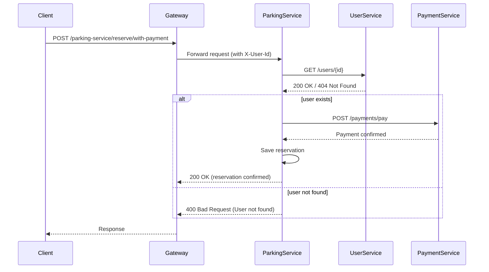
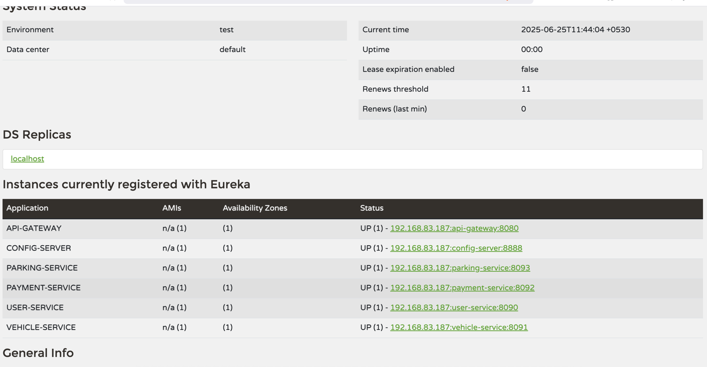

# Smart Parking Management System (Microservices Architecture)

This is a university-level Smart Parking Management System (SPMS) built using Spring Boot microservices architecture. The system is composed of independent services that communicate via REST and are secured using JWT-based authentication through an API Gateway.

---

## 🏗️ Architecture Overview

### 🔧 Services Implemented:

| Service           | Description                                    |
|------------------|------------------------------------------------|
| **API Gateway**   | Routes external traffic, handles JWT filtering |
| **User Service**  | Manages users, login, registration, roles       |
| **Vehicle Service** | Handles user vehicle data                      |
| **Parking Service** | Processes parking reservations                 |
| **Payment Service** | Mocks payments for parking                     |
| **Eureka Server** | Service registry and discovery                  |
| **Config Server** | Centralized externalized configuration         |

Services are registered with **Eureka Discovery Server** and use **Spring Cloud Config Server** for configuration. Services also use **Feign Clients** for inter-service communication.

---

## 🔐 Highlight: JWT Filter in API Gateway

The `api-gateway` service includes a custom **JWT validation filter** using Spring Cloud Gateway (WebFlux).

### Key Features:
- Intercepts requests and validates JWT.
- Adds extracted claims (userId, role) to headers for downstream services.
- Only allows access to secure endpoints if token is valid and role is authorized.

### Relevant Files:
- `JwtFilter.java`: GlobalFilter that validates token and sets authentication.
- `SecurityConfig.java`: WebFlux security configuration with role-based route protection.

### Example JWT Payload:
```json
{
  "sub": "shashi",
  "userId": "1",
  "role": "DRIVER",
  "iat": 1750585659,
  "exp": 1750589259
}
```

---

## 🔄 Highlight: Inter-Service Communication in Parking Service

### Scenario:
When a user reserves a parking spot:
1. `parking-service` calls `user-service` to verify the user exists.
2. If valid, it calls `payment-service` to mock a payment.
3. Only then it confirms the reservation.

### Technologies:
- **OpenFeign** clients (`UserClient`, `PaymentClient`)
- **DTO**: `ReservationRequestDto` contains all needed data from user.

### Endpoint:
```
POST /parking-service/reserve/with-payment
```
```json
{
  "userId": 1,
  "parkingSpotId": 101,
  "amount": 25.0,
  "paymentMethod": "CARD"
}
```

---

## 🔄 Inter-Service Communication Flow (Reservation)



Includes:
- Auth (login, register)
- Vehicle management
- Reservation flow (with payment)

---

## 📋 Sample Postman Request
```
POST /parking-service/reserve/with-payment
Headers:
  Authorization: Bearer eyJhbGciOi...
Body:
{
  "userId": 1,
  "parkingSpotId": 101,
  "amount": 25.0,
  "paymentMethod": "CARD"
}
```

---


## 🔌 Config Server Setup

- The **Spring Cloud Config Server** manages all service configurations.
- Each service includes this in its `application.yml`:
```yaml
spring:
  config:
    import: configserver:
```
- The server pulls config from a shared Git repo or local folder.

Start `config-server` before other services to ensure proper configuration injection.

---

## 🔍 Service Registration with Eureka

- All services register themselves to `eureka-server`
- Used by API Gateway and Feign clients for discovery

### 📸 Eureka Dashboard Example



---

## 🔁 Key Endpoints (via Gateway)

| Service         | Method | Endpoint                                    |
|----------------|--------|---------------------------------------------|
| User Service    | POST   | `/user-service/users/login`                |
| User Service    | GET    | `/user-service/users/{id}`                 |
| Vehicle Service | GET    | `/vehicle-service/vehicles/user/{id}`      |
| Parking Service | POST   | `/parking-service/reserve/with-payment`    |
| Payment Service | POST   | `/payment-service/payments/pay`            |

All requests (except login/register) require:
```
Authorization: Bearer <JWT Token>
```

---

## 🚀 Tech Stack
- Java 17
- Spring Boot 3.x
- Spring Cloud Gateway
- Spring Cloud Config Server
- Spring Cloud Eureka
- Spring Security (JWT)
- Spring Data JPA
- OpenFeign
- Postman (for testing)

---

## ✅ Features Completed
- [x] JWT authentication + API Gateway filter
- [x] Role-based authorization
- [x] Feign-based inter-service calls
- [x] Chained reservation + payment flow
- [x] Eureka & Config Server setup
- [x] Postman collection for testing endpoints

---

## 📦 Postman Collection Import

> Upload this `.json` file to Postman:

👉 [Download Postman Collection](./API%20Collection.postman_collection.json)


## 🧑‍💻 Author
Shashi Madushan -  Microservice Project

